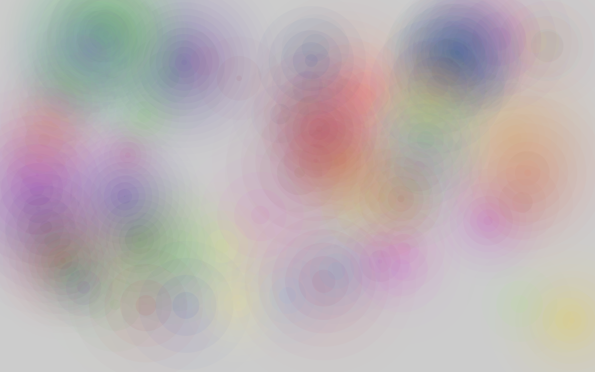

# Ripples
My personal desktop background generator.

## Setup
To run Ripples, you'll need the following:
- [Rust](https://www.rust-lang.org/tools/install)
- [wasm-pack](https://rustwasm.github.io/wasm-pack/installer/) 
- [Node](https://nodejs.org/en/)

## Building
To compile the Rust code to wasm: `wasm-pack build` from the root directory.

To start the frontend dev server: from the [www](www) directory, run `npm install` to get dependencies, followed by `npm start` in the same folder.

You can see the application by visiting [localhost:8080](localhost:8080).
Click and drag to see ripples! Press the spacebar to toggle pause.

## Configuring
You'll find a configuration file under `www/params.json`. Here's an explanation of what each field does:
- `hue`: A base hue to use for random colors. See `randomcolor`'s [documentation](https://www.npmjs.com/package/randomcolor) for details.
- `freqMin` and `freqMax`: The "frequency" of a ripple is how many frames it takes for a new circle to appear. Each ripple will have a random frequency between `freqMin` and `freqMax`.
- `magMin` and `magMax`: The "magnitude" of a ripple is how large its circle becomes. Each ripple has a random magnitude between `magMin` and `magMax`.
- `backgroundColor`: A color string representing the color of the background of the canvas.
- `autodraw`: Configuration data for automatic ripple generation, explained below.

### Autodraw
Autodraw will draw circles on the canvas, top-down then left-right, according to the configuration parameters. It will then automatically pause.
- `active`: A boolean determining whether to use autodraw.
- `stopFrame`: The number of frames after drawing the final ripple to let the animation run.
- `circlesPerFrame`: The number of new ripples to draw per frame.
- `{x,y}{Start,End}Offs` : The program will attempt to begin drawing ripples beyond the boundaries of the canvas, as specified on each axis by these offsets.
- `{x,y}Step`: The distance between the centers of circles for each coordinate.
- `{x,y}Spread`: The spread parameters introduce an amount of random variance in the coordinate of a ripple along the grid outlined by the steps.

### My Configuration
To generate my own personal desktop backgrounds, I generated images with different background colors to represent a different time of day, swapping hourly from 8AM to 3AM. These images were then swapped out by a scheduled [launchd](https://www.launchd.info/) job (analagous to a Linux cronjob). I originally tried to do this with a Haskell thing (found [here](https://github.com/noloerino/dotfiles/blob/master/desktopbg.hs)) but ultimately got too lazy to generate more than 2.

The numeric parameters I used can be found in `www/params.json`.

The 24 different background colors were created by messing around with the [paletton color scheme generator](https://paletton.com/). Spacing matters, as the color string was also used as the random seed. They're listed here:
- 20 (8PM) `rgba( 49, 81, 81,1)`
- 21 `rgba( 23, 97, 97,1)`
- 22 `rgba(  5, 73, 73,1)`
- 23 `rgba(  0, 12, 12,1)`
- 0 `rgba(  0, 30, 30,1)`
- 1 `rgba( 40,  6,  0,1)`
- 2 `black`
- 3 `rgba( 53,  2, 71,1)`
- 4 `rgba( 84, 13,  0,1)`
- 5 `rgba(107, 39,  0,1)`
- 6 with luck, I'm not awake at 6 or 7 AM
- 7 not that I'm awake at 3, 4, or 5 AM either, but I generated too many colors
- 8 `rgba(255,190,183,1)`
- 9 `rgba(200,163,185,1)`
- 10 `rgba(160,132,186,1)`
- 11 `rgba(154,178,208,1)`
- 12 `rgba(147, 99,191,1)`
- 13 `rgba(149, 84,208,1)`
- 14 `rgba(135,118,151,1)`
- 15 `rgba(145,158,196,1)`
- 16 `rgba( 64,125,205,1)`
- 17 `rgba( 86,135,198,1)`
- 18 `rgba( 38,117,218,1)`
- 19 `rgba(112,150,199,1)`

